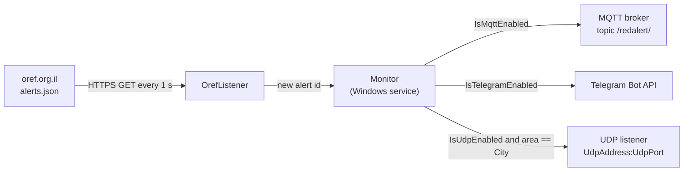

# Red Alert Windows Service
__________________________________________

[](License)

A C# Windows service that polls the [Oref website](https://www.oref.org.il/) (Israel's Home Front Command, Pikud HaOref) for "Red Alert" (Tzeva Adom) warnings and forwards each new alert over the **MQTT** protocol, to a **Telegram** bot/channel, and/or as a **UDP** packet to a device on your network. It is meant for home automation setups (for example Home Assistant with a Mosquitto broker) that want to react to alerts: turn on lights, play a sound, send a notification.

> [!WARNING]
> **Unofficial project. Not a life-safety system.**
> This project is not affiliated with, endorsed by, or connected to Pikud HaOref (the Home Front Command), the IDF, or any government body. It depends on an undocumented public web endpoint that can change, be blocked, or be delayed at any time, and the service can miss alerts or deliver them late. **Never rely on it to protect life or property.** Always follow the official Home Front Command app, the official website, and the sirens.

## Table of contents

- [Features](#features)
- [How it works](#how-it-works)
- [Requirements](#requirements)
- [Building](#building)
- [Installation](#installation)
- [Service configuration](#service-configuration)
- [Outputs](#outputs)
- [Usage with Home Assistant](#usage-with-home-assistant)
- [Logging](#logging)
- [Troubleshooting](#troubleshooting)
- [Security notes](#security-notes)
- [Development](#development)
- [Contributing](#contributing)
- [License](#license)

## Features

- Runs as a native Windows service (`ServiceBase`), installable with `InstallUtil.exe`.
- Polls `https://www.oref.org.il/WarningMessages/alert/alerts.json` once per second.
- Fires each alert only once: alerts are de-duplicated by their `id`.
- Three independent outputs, each switched on or off in `RedAlert.exe.config`:
  - **MQTT**: publishes the full alert as JSON to the `/redalert/` topic.
  - **Telegram**: sends a text message (title, date/time, list of areas) through the Telegram Bot API.
  - **UDP**: sends a `RedAlert` datagram to a host and port of your choice, only when the alert includes the area set in `City`.
- Debug mode that reads a test feed instead of the live Oref endpoint.
- Errors are appended to a plain text log file next to the executable.

## How it works



1. `OrefListener` runs a timer that fires every 1,000 ms. On each tick it downloads the Oref alerts JSON over TLS 1.2, with browser-like `Referer`, `User-Agent` and `X-Requested-With` headers.
2. An empty response means there is no active alert. Otherwise the JSON is deserialized into an `Alert` object (`id`, `title`, `data`).
3. If the alert `id` was not seen before in this run, the `OnAlert` event is raised with the alert and the local time it was received, and the `id` is remembered.
4. `Monitor` (the service class) forwards the alert to every enabled output.
5. If a request fails, the exception is logged and the timer thread waits 3 seconds.

## Requirements

- Windows with the **.NET Framework 4.5** or later (the project targets `v4.5`).
- To build: Visual Studio (the solution was created with Visual Studio 2013, and the project uses MSBuild `ToolsVersion` 14.0) or MSBuild for the .NET Framework.
- Network access from the machine to `www.oref.org.il` over HTTPS. The operating system must support TLS 1.2.
- Optional, depending on the outputs you enable:
  - An MQTT broker (for example Mosquitto) reachable on port 1883.
  - A Telegram bot token and a chat or channel the bot can post to.
  - A device listening for UDP datagrams.

NuGet dependencies are committed under `packages/`:

| Package | Version referenced by `RedAlert.csproj` |
|---|---|
| [M2Mqtt](https://www.nuget.org/packages/M2Mqtt/) | 4.3.0.0 |
| [Newtonsoft.Json](https://www.nuget.org/packages/Newtonsoft.Json/) | 12.0.3 (`packages.config` lists 13.0.1) |

## Building

There are no published releases, so build the service from source:

1. Clone the repository:
   ```
   git clone https://github.com/t0mer/Redalert-Windows-Service.git
   ```
2. Open `RedAlert.sln` in Visual Studio and build the **Release** configuration, or run from a Developer Command Prompt:
   ```
   msbuild RedAlert.sln /p:Configuration=Release
   ```
3. The output is written to `bin\Release\`.

## Installation

1. Create a new folder under Program Files, for example `C:\Program Files\RedAlert`, and copy these files from the build output into it:
   - `RedAlert.exe`
   - `RedAlert.exe.config`
   - `Newtonsoft.Json.dll`
   - `M2Mqtt.Net.dll`
2. Edit `RedAlert.exe.config` (see [Service configuration](#service-configuration)). **Set every `Is…Enabled` key to `true` or `false` before you start the service.**
3. Open a Command Prompt **as Administrator** and register the service with `InstallUtil.exe`:
   ```
   C:\Windows\Microsoft.NET\Framework64\v4.0.30319\InstallUtil.exe "C:\Program Files\RedAlert\RedAlert.exe"
   ```
4. Start the service, and optionally make it start with Windows (the installer registers it with the **Manual** start type):
   ```
   sc config "RedAlert Gateway Service" start= auto
   sc start "RedAlert Gateway Service"
   ```

The installer (`ProjectInstaller`) registers the service as follows:

| Property | Value |
|---|---|
| Service name | `RedAlert Gateway Service` |
| Display name | `RedAlert Gateway` |
| Description | `RedAlert Gateway Service` |
| Account | `LocalSystem` |
| Start type | Manual (installer default) |

To uninstall, stop the service and run:

```
sc stop "RedAlert Gateway Service"
C:\Windows\Microsoft.NET\Framework64\v4.0.30319\InstallUtil.exe /u "C:\Program Files\RedAlert\RedAlert.exe"
```

## Service configuration

### RedAlert.exe.config

All settings are `appSettings` keys in `RedAlert.exe.config` (built from `App.config`). They are read when the service starts, so **restart the service after every change**. Open the file in any text editor and fill in the settings:

```xml
<appSettings>
  <!--General Settings-->
  <add key="IsDebugMode" value="false"/>

  <!--Area name used by the UDP output (exact match)-->
  <add key="City" value=""/>

  <!--Telegram Bot Settings-->
  <add key="IsTelegramEnabled" value="true"/>
  <add key="telegramApi" value="YOUR_BOT_TOKEN"/>
  <add key="channelId" value="YOUR_CHAT_ID"/>
  <add key="telegramApiUrl" value="https://api.telegram.org/bot{0}/sendMessage?chat_id={1}&amp;text={2}"/>

  <!--Mqtt Settings-->
  <add key="IsMqttEnabled" value="true"/>
  <add key="MqttHost" value="YOUR_BROKER_HOST"/>
  <add key="MqttUser" value="YOUR_MQTT_USER"/>
  <add key="MqttPass" value="YOUR_MQTT_PASSWORD"/>

  <!--UDP Settings-->
  <add key="IsUdpEnabled" value="false"/>
  <add key="UdpAddress" value=""/>
  <add key="UdpPort" value=""/>
</appSettings>
```

| Key | Default in `App.config` | Description |
|---|---|---|
| `IsDebugMode` | `false` | `true` polls a test feed (`https://techblog.co.il/alerts.json`) instead of the live Oref endpoint. Must be `true` or `false`. <!-- TODO: verify the test feed is still online --> |
| `City` | *(empty)* | Area name, in Hebrew, exactly as it appears in the Oref `data` list. Used **only** by the UDP output: a datagram is sent only when an alert contains this area. MQTT and Telegram always receive every alert. |
| `IsTelegramEnabled` | `true` | Enables the Telegram output. Must be `true` or `false`. |
| `telegramApi` | *(empty)* | Telegram bot token from [@BotFather](https://t.me/BotFather). Inserted as `{0}` in `telegramApiUrl`. |
| `channelId` | `orefredalert` | Target chat: a numeric chat ID, or `@channelusername` for a public channel. Inserted as `{1}` in `telegramApiUrl`. The Bot API expects a channel username with a leading `@`, so the default `orefredalert` most likely needs to be changed to `@orefredalert` (or a numeric chat ID). |
| `telegramApiUrl` | `https://api.telegram.org/bot{0}/sendMessage?chat_id={1}&amp;text={2}` | URL template for the Bot API call. `{0}` = token, `{1}` = chat, `{2}` = message text. Keep the `&amp;` escape; the file is XML. |
| `IsMqttEnabled` | `true` | Enables the MQTT output. Must be `true` or `false`. When `true`, the service connects to the broker as it starts. |
| `MqttHost` | *(empty)* | Broker host name or IP address. The port is the M2Mqtt default, 1883, without TLS. |
| `MqttUser` | *(empty)* | MQTT user name. |
| `MqttPass` | *(empty)* | MQTT password. |
| `IsUdpEnabled` | *(empty)* | Enables the UDP output. **Must be set to `true` or `false`**: the empty default stops the service from starting. |
| `UdpAddress` | *(empty)* | IPv4 address that receives the UDP datagram. |
| `UdpPort` | *(empty)* | UDP port on `UdpAddress`. |

[How to create a Telegram bot](https://techblog.co.il/2019/11/%D7%A9%D7%9C%D7%99%D7%97%D7%AA-%D7%94%D7%95%D7%93%D7%A2%D7%95%D7%AA-%D7%9C%D7%A2%D7%A8%D7%95%D7%A5-%D7%98%D7%9C%D7%92%D7%A8%D7%9D-%D7%91%D7%93%D7%A8%D7%9A-%D7%94%D7%A7%D7%9C%D7%94/) (Hebrew)

## Outputs

### MQTT

| Property | Value |
|---|---|
| Topic | `/redalert/` (with the leading and trailing slash) |
| QoS | 2 (exactly once) |
| Retained | No |
| Client ID | A new random GUID every time the service starts |

The payload is the alert serialized as JSON:

```json
{
  "data": ["<area 1>", "<area 2>"],
  "id": 132186000000000000,
  "title": "<alert title>"
}
```

`data` is the list of areas (in Hebrew), `id` is the Oref message ID, and `title` is the alert title, as returned by Oref. The values above are placeholders.

### Telegram

For each new alert the service sends one message with the alert title, the local date and time the service received it (`dd/MM/yyyy HH:mm`), and one area per line:

```
<alert title>
<dd/MM/yyyy HH:mm>
<area 1>
<area 2>
```

The message is sent as an HTTP GET to the `telegramApiUrl` template.

### UDP

When `IsUdpEnabled` is `true` and one of the alert areas is exactly equal to `City`, the service sends the ASCII string `RedAlert\n` as a single UDP datagram to `UdpAddress:UdpPort`. This is handy for microcontrollers (for example an ESP8266 or ESP32) that only need to know "there is an alert in my area".

## Usage with Home Assistant

The examples below use the MQTT sensor syntax that current Home Assistant versions expect in `configuration.yaml`. Older versions used a `sensor:` entry with `platform: mqtt`, which Home Assistant no longer supports.

### Get the full JSON (including id and title)

```yaml
mqtt:
  sensor:
    - name: "Red Alert"
      state_topic: "/redalert/"
      icon: mdi:broadcast
      value_template: "{{ value_json }}"
      qos: 1
```

### Get the alert areas only

```yaml
mqtt:
  sensor:
    - name: "Red Alert"
      state_topic: "/redalert/"
      icon: mdi:broadcast
      value_template: "{{ value_json.data }}"
      qos: 1
```

Home Assistant limits a sensor state to 255 characters, and an alert that covers many areas can be longer. In that case keep a short state (for example `{{ value_json.id }}`) and add `json_attributes_topic: "/redalert/"` to expose `data` and `title` as attributes.

The service does not publish a "clear" message when an alert ends, and messages are not retained, so the sensor keeps the last alert until the next one arrives.

## Logging

Errors are appended to `Redalert.log` in the folder that contains `RedAlert.exe` (for example `C:\Program Files\RedAlert\Redalert.log`). Only exceptions are logged (failed Oref requests, MQTT publish errors, UDP errors); successful alerts are not. The file is never rotated, so check its size from time to time. Telegram send errors are not logged.

## Troubleshooting

- **The service fails to start right away.** Check that `IsDebugMode`, `IsTelegramEnabled`, `IsMqttEnabled` and `IsUdpEnabled` are all set to `true` or `false`; an empty or misspelled value stops the service. With MQTT enabled, the broker set in `MqttHost` must also be reachable, and the credentials must be valid, when the service starts.
- **MQTT stops working after the broker restarts.** The service connects once at startup and does not reconnect. Restart the service after broker outages.
- **`Could not create SSL/TLS secure channel` in the log.** The service could not open an HTTPS connection to Oref. Make sure the operating system and .NET Framework support TLS 1.2, and that the machine can reach `www.oref.org.il` (the site may restrict access from some networks).
- **No UDP packet arrives.** `City` must match an area name in the Oref data exactly, character for character, in Hebrew. Wildcards are not supported. Also check that `UdpAddress` is a valid IPv4 address and the port is open on the receiving device.
- **No Telegram message.** Check the bot token, that the bot is a member (or an administrator) of the target channel or group, and the `channelId` format. Failures are not logged, so test the `telegramApiUrl` values in a browser if needed.
- **Configuration changes have no effect.** Restart the service; settings are only read at startup.
- **The same alert is sent again after a restart.** Seen alert IDs are kept in memory only, so an alert that is still active when the service starts is sent once more.

## Security notes

- `RedAlert.exe.config` stores the Telegram bot token and the MQTT user name and password in plain text. Restrict who can read the installation folder, and never commit a filled-in config file.
- MQTT is sent without TLS. Keep the broker on a trusted local network, and use a dedicated MQTT user with write access limited to the `/redalert/` topic.
- The Telegram bot token is part of the request URL. Anyone with the token can control the bot; revoke it with @BotFather if it leaks.
- The service runs as `LocalSystem`. If you prefer, change the service to run under a less privileged account that can write to the installation folder (for the log file).
- The UDP datagram is unauthenticated. Any device on the network can send the same packet, so do not use it to trigger anything sensitive.

## Development

Project layout:

| Path | Description |
|---|---|
| `Program.cs` | Entry point; runs the `Monitor` service. |
| `Monitor.cs` | The Windows service: starts and stops the listener and forwards alerts to MQTT, Telegram and UDP. |
| `ProjectInstaller.cs`, `ProjectInstaller.Designer.cs` | Service installer used by `InstallUtil.exe` (name, account, description). |
| `Alert.cs` | Alert model (`data`, `id`, `title`). |
| `Helpers/OrefListener.cs` | Polls the Oref endpoint, de-duplicates alerts and raises `OnAlert`. |
| `Helpers/MqttPublisher.cs` | MQTT client (M2Mqtt) that publishes to `/redalert/`. |
| `Helpers/TelegramBot.cs` | Sends messages through the Telegram Bot API. |
| `Common/` | Event argument classes (`AlertEventArgs`, `ExceptionEventArgs`). |
| `Structs/`, `eums/` | `ServiceStatus` struct and `ServiceState` enum used with `SetServiceStatus`. |
| `App.config` | Default settings; copied to `RedAlert.exe.config` on build. |
| `packages/` | Committed NuGet packages (M2Mqtt, Newtonsoft.Json). |

To test the whole pipeline without a real alert, set `IsDebugMode` to `true` so the service reads the test feed instead of the live endpoint. There are no automated tests.

## Contributing

Issues and pull requests are welcome. Please keep changes small and focused, never commit real tokens or passwords, and describe how you tested the change.

## License

This project is licensed under the Apache License 2.0. See [License](License) for the full text.
